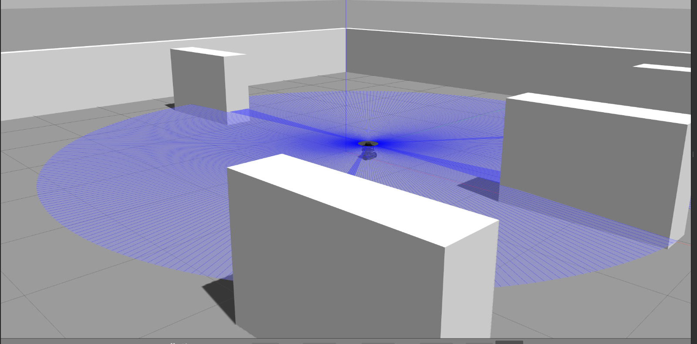
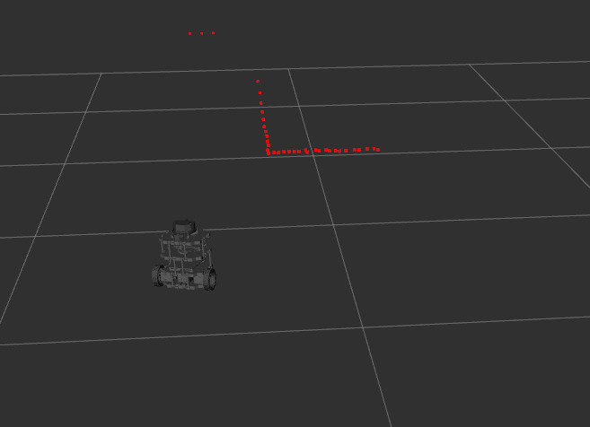

# Autonomous Utility Store Robot — FYP

ROS 2 project for an autonomous mobile robot that navigates a utility store,
identifies products, and picks items using a servo arm.

**Status:** In Progress — Gazebo simulation phase

## Stack
- ROS 2 Humble
- Gazebo
- SLAM (slam_toolbox)
- Nav2
- RPLidar A1
- Ubuntu 22.04

## Package Structure
```
ros2_ws/
└── src/
    └── my_robot_pkg/
        ├── launch/      # Launch files
        ├── worlds/      # Gazebo world files
        ├── rviz/        # RViz2 config files
        ├── docs/        # Progress screenshots
        └── include/     # C++ headers (reserved)
```

## Progress

### Gazebo Simulation — LiDAR Visualization

TurtleBot3 loaded into custom store world. 360° LiDAR rays actively
detecting shelf obstacles in simulation.

### RViz2 — Live LiDAR from RPLidar A1


Real-time /scan data from physical RPLidar A1 hardware visualized in
RViz2. Confirms full sensor pipeline on Ubuntu + ROS 2.

## Running the Simulation
```bash
source /opt/ros/humble/setup.bash
colcon build
source install/setup.bash
ros2 launch my_robot_pkg utility_store.launch.py
```

## Roadmap
- [x] Gazebo world setup
- [x] LiDAR sensor integration
- [ ] SLAM mapping
- [ ] Nav2 autonomous navigation
- [ ] YOLOv8 product detection
- [ ] Servo arm control
- [ ] Full mission pipeline
