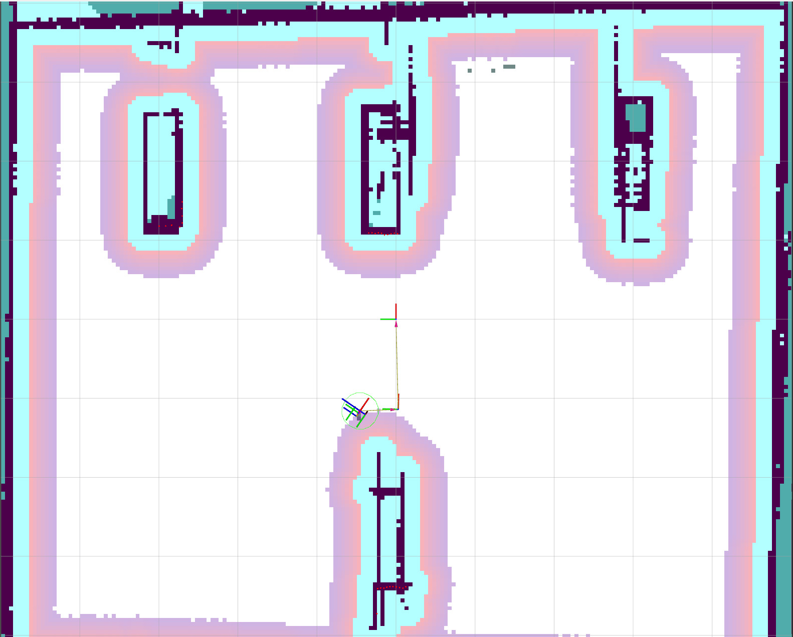
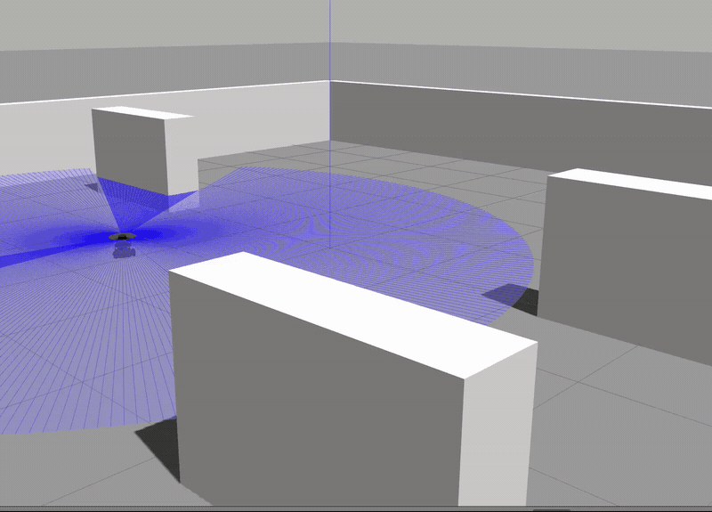
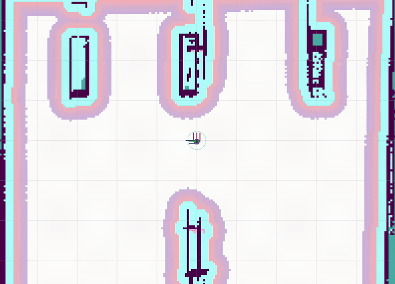

# Autonomous Utility Store Robot — FYP

ROS 2 project for an autonomous mobile robot that navigates a utility store,
identifies products, and picks items using a servo arm.

**Status:** In Progress — Gazebo simulation phase

## Stack
- ROS 2 Humble
- Gazebo
- SLAM (slam_toolbox)
- Nav2
- RPLidar A1
- Ubuntu 22.04

## Package Structure
```
ros2_ws/
└── src/
    └── my_robot_pkg/
        ├── launch/      # Launch files
        ├── worlds/      # Gazebo world files
        ├── rviz/        # RViz2 config files
        ├── docs/        # Progress screenshots
        └── include/     # C++ headers (reserved)
```

## Progress

### Gazebo Simulation — LiDAR Visualization
<p align="center">
  
</p>
TurtleBot3 loaded into custom store world. 360° LiDAR rays actively
detecting shelf obstacles in simulation.

### RViz2 — Live LiDAR from RPLidar A1
<p align="center">
  
</p>
Real-time `/scan` data from the physical RPLidar A1 visualized in RViz2

### SLAM Mapping — Store Environment
<p align="center">
  
</p>
2D occupancy grid map generated using `slam_toolbox` inside the custom
store environment. The robot successfully performs real-time mapping and
localization using LiDAR data.


Real-time /scan data from physical RPLidar A1 hardware visualized in
RViz2. Confirms full sensor pipeline on Ubuntu + ROS 2.

### Nav2 Global Costmap

<p align="center">
  
</p>

Nav2 global costmap generated from the SLAM occupancy map. The costmap includes the static map, detected obstacles, and inflated safety regions around walls and shelves that Nav2 uses for path planning.

### Gazebo Simulation — LiDAR Visualization

<p align="center">
  
</p>

TurtleBot3 running inside the custom utility store environment with simulated 360° LiDAR detecting shelves and surrounding obstacles.

### Nav2 Autonomous Navigation

<p align="center">
  
</p>

A navigation goal is sent to the robot through Nav2, which generates a path on the global costmap and drives the robot toward the target while respecting obstacle and inflation regions.

## Running the Simulation
```bash
source /opt/ros/humble/setup.bash
colcon build
source install/setup.bash
ros2 launch my_robot_pkg utility_store.launch.py
```

## Roadmap
- [x] Gazebo world setup
- [x] LiDAR sensor integration
- [x] SLAM mapping
- [x] Nav2 autonomous navigation
- [x] Servo arm control
- [ ] YOLOv8 product detection
- [ ] Full mission pipeline
